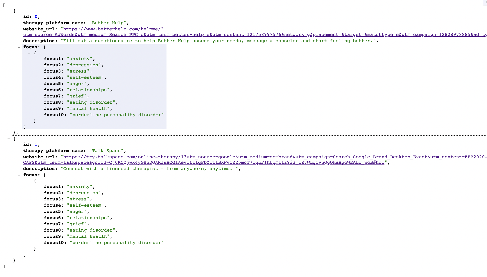

#mentalHealth-api

#### My mental health api groups together a list of self care ideas, products and ways to improve your mental health.

Link to API can be found here: <a href="https://mentalhealth-api.herokuapp.com/"  target="_blank">Mental Health API</a>

Link to books API can be found here: <a href="https://mentalhealth-api.herokuapp.com/books" target="_blank">Books API</a>

Link to ideas API can be found here: <a href="https://mentalhealth-api.herokuapp.com/selfCare_ideas"  target="_blank">Ideas API</a>

#running json-server

#creating heroku project

#Successful build

#API

